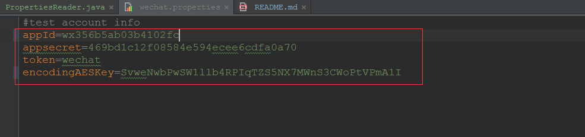

# wechat-core

##项目介绍
1. 封装了微信消息接收与发送模块，可以使用注解方便的进行业务开发而不用关注消息接收和消息发送的细节。

2. 内部封装了消息处理器抽象类，该类提供处理消息前的消息过滤、默认行为日志等功能，用户可继承该类实现自己的业务。

3. 将处理各个类型的消息处理器分开了，避免大段的if elseif elseif，每个接口职责清晰明了，实现更解耦；

##所用技术介绍
1. 所用编程语言为java，代码中的注释非常详细，详细读者一定能看懂。目前只集成了springmvc，后续可能会增加对其他组件的支持。

##项目架构剖析

##快速入门（不含微信公众平台申请及接口url、token等配置步骤）

1. 在classpath根路径下创建**wechat.properties**属性文件，配置appId、appsecret、token、encodingAESKey(**名字必须跟这个一样**)，
   示例如下图：

2. 编写消息处理器类，继承**AbstractMessageHandler**抽象类，实现**doHandleMessage**方法，在该类上加上@**MessageWorker**的注解，并指明要处理的消息类型，
示例代码如下：     
    
    @MessageWorker(type = MessageType.TEXT_MESSAGE)    
    public class TextMessageHandler extends AbstractMessageHandler {    
        private static final Logger LOGGER = LoggerFactory.getLogger(TextMessageHandler.class);    
    
        public BaseResponseMessage doHandleMessage(BaseRequestMessage requestMessage) {    
            if (requestMessage instanceof TextRequestMessage) {    
                //在这里实现你自己的业务逻辑    
                return MessageUtils.buildTextResponseMessage(requestMessage, "hello,world");    
            }    
            return null;    
        }    
    }    
         
3. just run your application !! have fun...

##示例代码***

1. **各种消息类型的接收与回复的示例代码放在[示例代码](https://github.com/151376liujie/wechat-core/tree/master/src/main/java/com/jonnyliu/proj/wechat/example)包下，供读者朋友们参考**

##TODO

1. 正在增加获取access_token的功能，并提供对它的缓存功能（因为access_token有效期只有两个小时）。
   
2. 增加当用户关注公众号时获取用户基本信息并回复给用户的功能。
   
##不足之处
   
1. 目前的注解只支持区分不同类型的消息处理器，所以处理事件的消息处理器中还是不可避免的需要使用if else if来判断不同的事件类型（关注事件、取消关注事件、
   扫描二维码事件、上传地理位置事件、自定义菜单点击和浏览事件等）。未来会在原来注解的基础上增加对事件类型的区分功能。
      
2. 目前的功能还不够丰富，后续会陆续增加功能。

##联系作者
邮箱：980463316@qq.com ,欢迎相互交流，共同进步。

